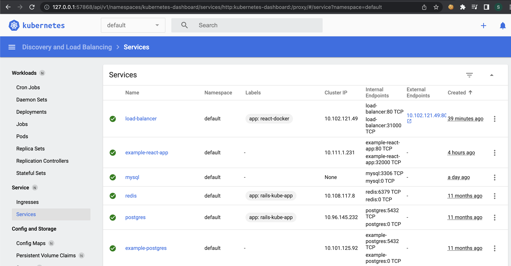

#### some parts reused from 
https://blog.logrocket.com/deploy-react-app-kubernetes-using-docker/

  ✗ docker build -t react-docker .
  ✗ docker images react-docker

  ✗ docker run -dit -p 3000:80 react-docker:latest

  ✗ docker stop $(docker ps -a -q)

kubectl create namespace react-docker
kubectl config set-context --current --namespace=react-docker

  ✗ eval $(minikube docker-env)
  ✗ minikube dashboard

  ✗ kubectl apply -f ./k8s/deployment.yaml
  ✗ kubectl get deployment -w

  ✗ kubectl apply -f ./k8s/load-balancer.yaml
  ✗ kubectl get services -w

http://your_minikube_ip:31000
  minikube ip

  ✗ minikube tunnel
  pass password

and should working in browser http://10.102.121.49/

#### in minikube dashboard this sucess will lokkis like as ( first row :-) ) 

kubectl scale deployment react-docker --replicas=10
kubectl get deployment -w

kubectl scale deployment react-docker --replicas=3
